<h1 align="center">Compilar C no VSCode</h1>

<h4 align="center">Windows 10 - Junho 2020<h4>

Aos amantes do  VSCode, que não querem larga-lo nem na hora de escrever seus códigos em C.  
Segue as instruções de como configurar de forma fácil e rápida.

<h3>Instale duas extensões no VSCode</h3>
<ol>
  <li>
    <a href="img/c_c++.jpg">C/C++</a>
  </li>
  
  <li>
    <a href="img/compile_Run.jpg">C/C++ Compile Run</a>
  </li>

</ol>

 

<h3>Agora vamos instalar o copilador mimgw no pc(Testei apenas no Windows)</h3>

Segue o 
  <a href="https://pt.osdn.net/projects/mingw/downloads/68260/mingw-get-setup.exe/">Link
  </a> para baixar
 

<i>O link acima já leva para a página aonde irá baixar o arquivo (mingw-get-setup.exe: 93,184 bytes)</i>

<h2>Instale normalmente o mingw</h2>
<i>Lembrando que tem que ser instalado do C:</i>

 

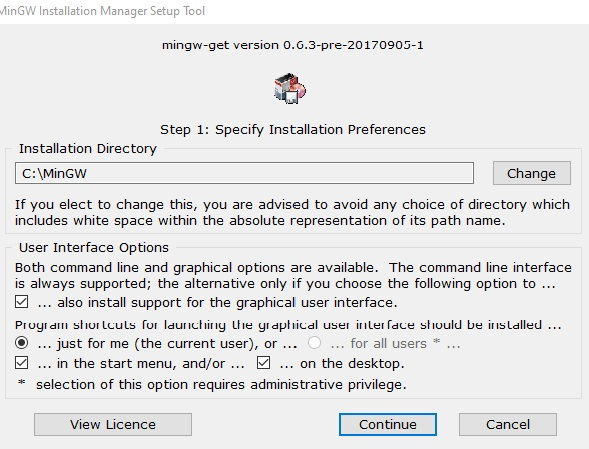

Após instalado, irá abrir o programa automaticamente

  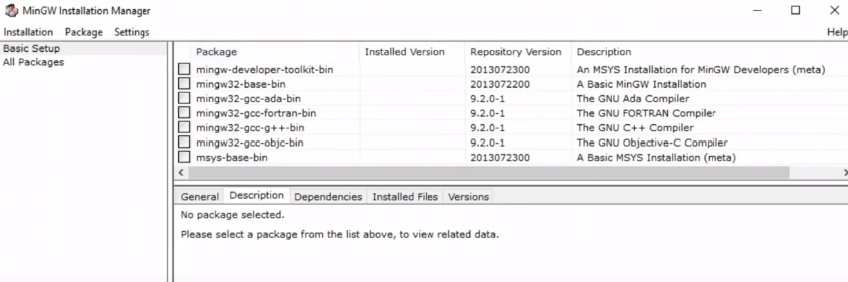

<h3>Agora precisa instalar um pacote adicional</h3>
  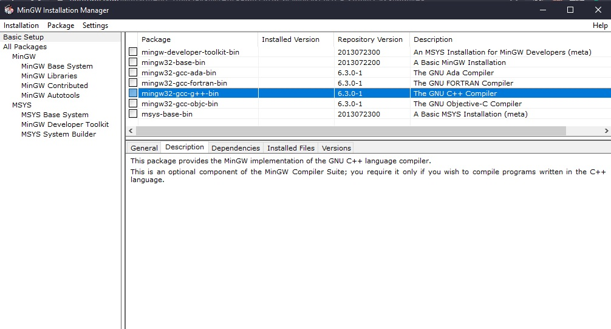

<h3>"Mark for installation"
  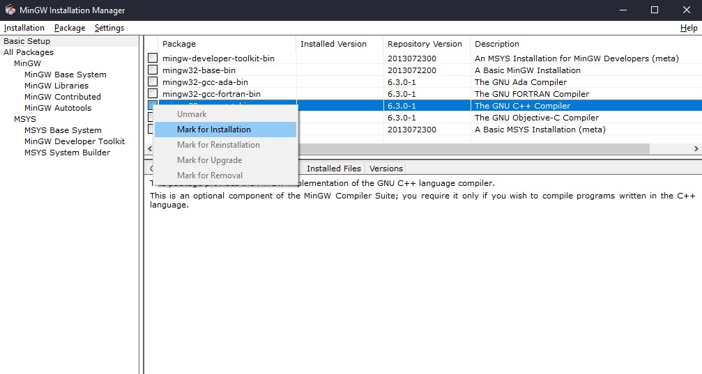

<h3>Vai na Aba "Installation" e click em "Apply Changes"</h3>
  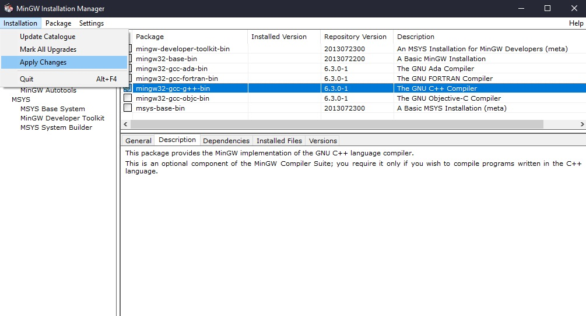

  

<h2 align="center">Agora Vamos configurar o path do Windows</h2>

<h3>Depois vai no C: e irá ter a pasta MinGW </h3>
    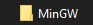

<h3>Abra ela, e irá ter uma pasta chamada bin </h3>
    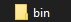

<h3>Abra a pasta bin para pegar o endereço que fica na barra de nagevação </h3>

  
Clique na barra de nagegação e copie o endereço

  
C:\MinGW\bin

    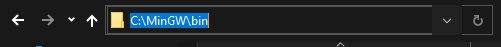

<h3>Agora vamos colocar  o endereço do bin no path do Windows</h3>
  
Vai no Painel de controle 

  
Vai em Sistemas

  
Configuração Avançado do Sistema

    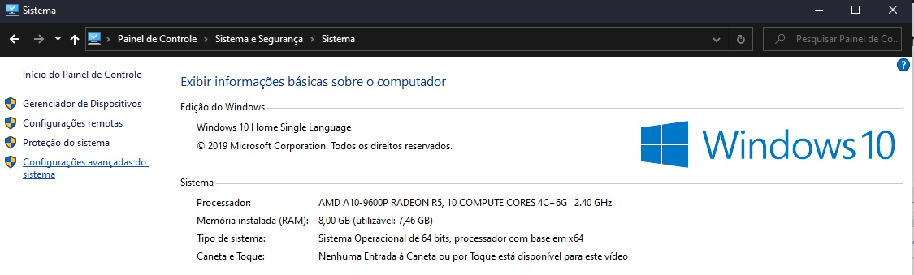

<h3>Na Aba Avançado, vai em Variáveis de Ambiente</h3>
    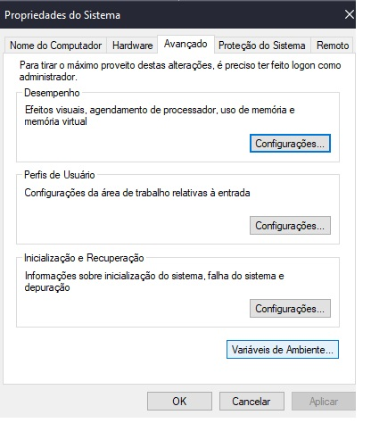

<h3>Dentro da "Variáveis do Sistema" Seleciona "Path"<h3>
    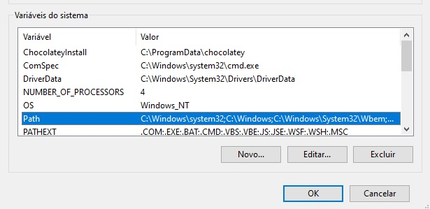

<h3>Agora vamos "Editar..."</h3>
    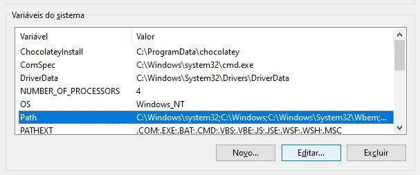

<h3>Vai em "Novo" que vai ser aonde que vai colocar o endereço da bin</h3>
    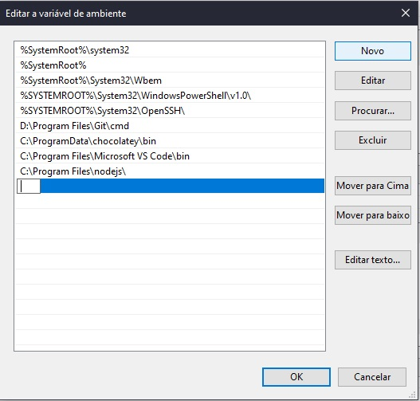

<h3>Confirme com "OK", depois "OK" e "OK".
    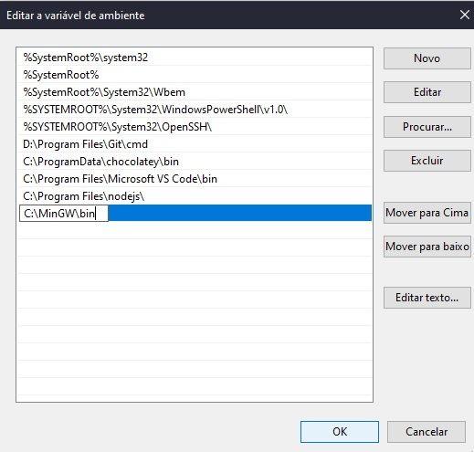

<h2 align="center">Compilando...</h2>

<h3>Para Compilar basta depois de escrever o código em C normalmente, clicar a tecla F6 </h3>

<h1 align="center">Prontinho! </h1>
